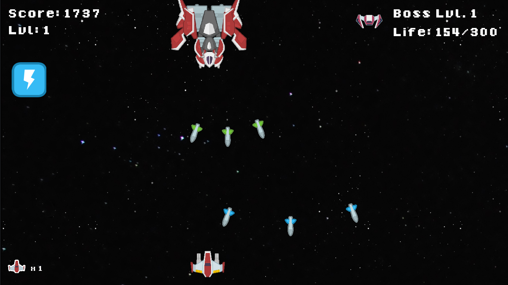

# Xeon Wars
Juego Shoot 'em up en C++. Curso 'Algoritmos y Estructuras de Datos II' del Tecnológico de Costa Rica.

## Requisitos de compilación:
- libmosquitto-dev
- libsfml-dev
- zlib1g-dev

## Estudiantes
- Joseph Vargas
- Gustavo Segura
- Jimena Salas
- Daniel Castro
- Ignacio Mora
